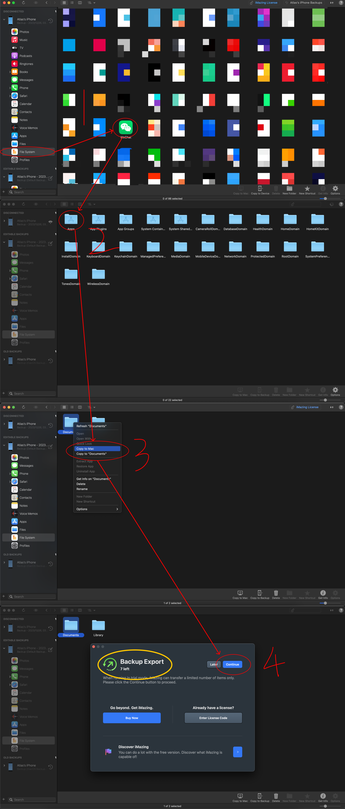

# WeChat Moment Exporter

这是一个导出朋友圈数据的脚本。运行程序后会得到 ``moments.json`` 文件在根目录下。如果重新展示出数据或者有上链存储备份需求的可以参考[这个仓库](https://github.com/Atlasoin/migrate-notes-2-csb)。

## 步骤

1. 如果是 ios 系统，需要先进行手机备份。推荐使用 [iMazing](https://imazing.com/)，免费版的就够，备份完成后找到微信的 Documents 文件，导出即可。免费版 iMazing 有 10 次导出机会。




在 Documents 文件夹里，存在着至少一个以 Hash 字符串命名的文件夹，像这样的

> eb8a6093b56e2f1c27fbf471ee97c7f9

这样的文件夹中就存放着微信用户的个人数据。如果在这个手机上登陆过多个微信，则可能存在多个这样的 Hash 命名的文件夹，如果不确定哪个是自己想要导出的，可以都导出看看。

找到 ./Documents/{hash}/wc/wc005_008.db 和 ./Documents/{hash}/DB/WCDB_Contact.sqlite，这两个就是需要解析的缓存文件了。前者是和朋友圈数据相关的表格，后者是和好友数据相关的表，这里我们需要这张表只是为了解析出自己账户的头像。

如果是安卓系统，我没有实验过，目录可能有所区别，但估计应该可以直接在手机文件系统中找到这样的两个数据库文件。

2. 将这两个数据库文件放在根目录，然后修改 ``main.py`` 里的 ``hash`` 变量，将其修改为刚刚文件夹名字里的那个 hash。


然后运行

```bash
python3 main.py
```

运行成功后，会在根目录生成一个 ``moments.json`` 的文件，这个文件里面存储着历史自己的朋友圈的内容，图片，分享的链接，分享的链接预加载后显示的图片和标题及简介。